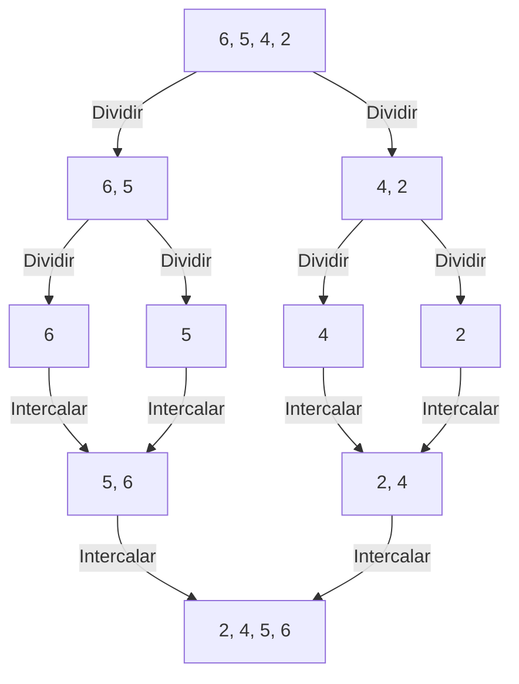
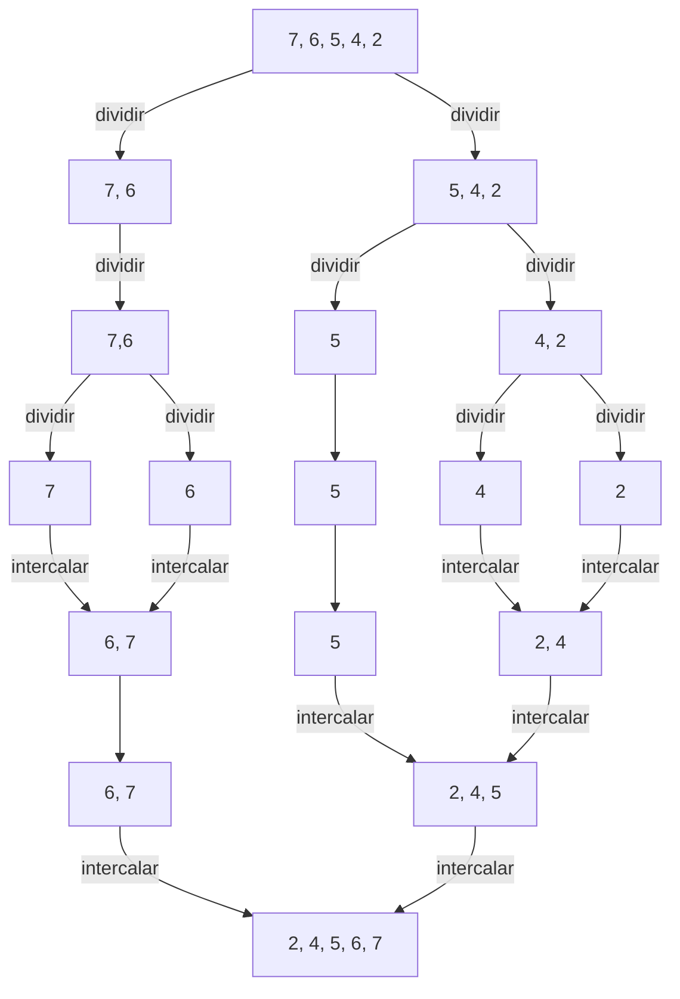
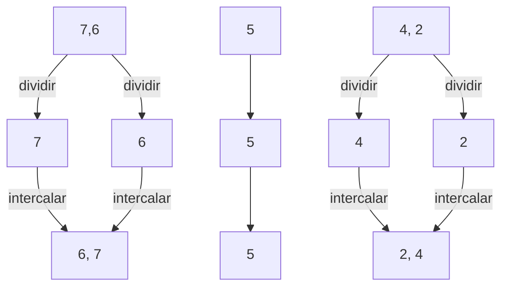
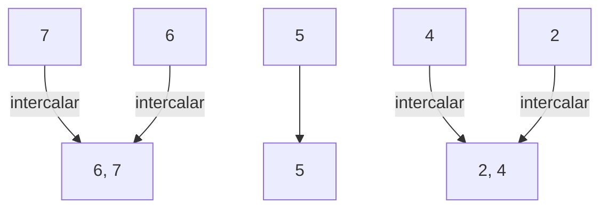
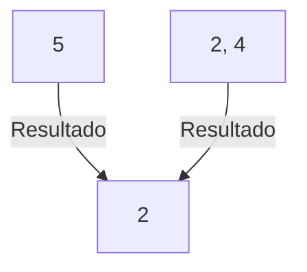
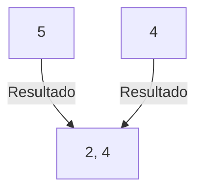
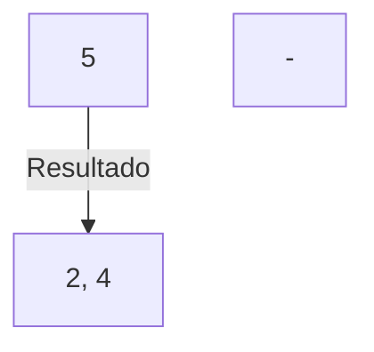

---
search:
  exclude: true
---

# Aula 03 - Análise de algoritmos e suas complexidades (pt. 2) e Módulos em Python









---


## Ordenação por intercalação

{: .center .shadow}

### A "lógica"

Na última aula foi provocado pensarmos em um paradigma algorítmico comum, conhecido como **dividir e conquistar**.

Já vimos essa estratégia, quando estudamos funções recursivas.

Basicamente consiste em:

- Desmembrar o problema em subproblemas semelhantes ao problema original.

- Resolvemos os subproblemas recursivamente.

- Então combinamos as soluções para os subproblemas para resolver o problema original.


Será que com essa estratégia, conseguiremos um $\Theta < n^2$?


Precisamos fazer dois movimentos básicos:

- Dividir a lista numérica.

- Intercalar os valores, segundo o comparativo binário.

### Exemplos

Isso significa que, por exemplo:



Parece fácil, que tal fazermos mais um exemplo, porém com uma quantidade impar de elementos.


`[7, 6, 5, 4, 2]`




### O algoritmo - A implementação

Assim como na ordenação por inserção

Iremos implementar a função `ordenacao_intercalacao`. 

Essa função irá receber um objeto python do tipo `list` e com seus elementos numéricos.


Para os passos a seguir iremos usar a lista numérica de 5 elementos: `[7, 6, 5, 4, 2]`

```py title="ordenacao_intercalacao" linenums="1"
def ordenacao_intercalacao(lista):
    ...

lista_numerica = [7, 6, 5, 4, 2]

print(f'Lista Desordenada: {lista_numerica} \n')
ordenacao_intercalacao(lista_numerica)
print(f'Lista Ordenada: {lista_numerica} \n')
```

```sh title="saída"
Lista Desordenada: [7, 6, 5, 4, 2]

Lista Ordenada: [7, 6, 5, 4, 2]
```

Iremos usar novamente as funções de impressão que utilizamos na aula anterior:

```py title="ordenacao_intercalacao" linenums="1" hl_lines="1 7 10 16"
def imprime_indices(lista):
    lista_indices = []
    for i in range(0, len(lista)):
        lista_indices.append(i)
    print(f'Indices: {lista_indices}')

def imprime_valores(lista):
    print(f'Valores: {lista}')

def imprime(lista):
    imprime_indices(lista)
    imprime_valores(lista)
    print('')

def ordenacao_intercalacao(lista):
    imprime(lista)

lista_numerica = [7, 6, 5, 4, 2]

print(f'Lista Desordenada: {lista_numerica} \n')
ordenacao_intercalacao(lista_numerica)
print(f'Lista Ordenada: {lista_numerica} \n')
```

```sh title="saída"
Lista Desordenada: [7, 6, 5, 4, 2]

Indices: [0, 1, 2, 3, 4]
Valores: [7, 6, 5, 4, 2]

Lista Ordenada: [7, 6, 5, 4, 2]

```

Nosso teste de mesa improvisado está pronto!

Vamos ao código!

#### Recapitulando:

A ideia da ordenação por intercalação é:

1. **Dividir** a lista numérica ao meio repetidamente até sobrar listas de tamanho 1 (que já estão ordenadas por natureza).

2. **Conquistar** ordenando cada metade recursivamente.

3. **Juntar** (intercalar) duas listas já ordenadas é uma única lista ordenada. 
    - **O coração do nosso algoritmo!**

Irei omitir as demais funções que usamos para depurar nosso código

Para que podemos concentrar apenas no nosso algoritmo.


#### Dividir!

Inicialmente precisamos implementar a parte que irá dividir todas as listas numéricas.

Sem a divisão não temos como conquistar.


Para isso precisamos saber o tamanho da nossa lista atual.

```py title="ordenacao_intercalacao" linenums="1" hl_lines="1"
```


```py title="ordenacao_intercalacao" linenums="15" hl_lines="4"
def ordenacao_intercalacao(lista):
    tamanho = len(lista)

    indice_meio = tamanho // 2

    print(f'Índice do meio: {indice_meio}')
    print(f'Metade esquerda: {lista[:indice_meio]}')
    print(f'Metade direita: {lista[indice_meio:]}')
```

```
ordenacao_intercalacao(lista_numerica)
```

``` title="saída"
Índice do meio: 2
Metade esquerda: [7, 6]
Metade direita: [5, 4, 2]
```

```py title="ordenacao_intercalacao" linenums="15" hl_lines="12 15 16"
def ordenacao_intercalacao(lista):
    tamanho = len(lista)
    
    indice_meio = tamanho // 2

    print(f'Índice do meio: {indice_meio}')
    print(f'Metade esquerda: {lista[:indice_meio]}')
    print(f'Metade direita: {lista[indice_meio:]}')
    print('')
    
    if tamanho <= 1:
        print(f'Lista unitária {lista} já está ordenada')
        print('')
    else:
        ordenacao_intercalacao(lista[:indice_meio])
        ordenacao_intercalacao(lista[indice_meio:])
```

``` title="saída"
Índice do meio: 2
Metade esquerda: [7, 6]
Metade direita: [5, 4, 2]

Índice do meio: 1
Metade esquerda: [7]
Metade direita: [6]

Índice do meio: 0
Metade esquerda: []
Metade direita: [7]

Lista unitária [7] já está ordenada
Índice do meio: 0
Metade esquerda: []
Metade direita: [6]

Lista unitária [6] já está ordenada
Índice do meio: 1
Metade esquerda: [5]
Metade direita: [4, 2]

Índice do meio: 0
Metade esquerda: []
Metade direita: [5]

Lista unitária [5] já está ordenada
Índice do meio: 1
Metade esquerda: [4]
Metade direita: [2]

Índice do meio: 0
Metade esquerda: []
Metade direita: [4]

Lista unitária [4] já está ordenada
Índice do meio: 0
Metade esquerda: []
Metade direita: [2]

Lista unitária [2] já está ordenada
```

Nossa divisão recursiva está pronta!


Vamos retomar a árvore nesse ponto:



Depois que chegarmos nas listas unitárias, para intercalar precisamos olhar para duas listas ao mesmo tempo.



Afim de facilitar vamos criar uma função para intercalar as listas, logo devemos passá-las via argumentos.


```py title="ordenacao_intercalacao" linenums="15" hl_lines="1 17 21"
def intercalar_listas_ordenadas(esquerda, direita):
    ...


def ordenacao_intercalacao(lista):
    tamanho = len(lista)

    indice_meio = tamanho // 2

    print(f'Índice do meio: {indice_meio}')
    print(f'Metade esquerda: {lista[:indice_meio]}')
    print(f'Metade direita: {lista[indice_meio:]}')
    print('')

    if tamanho <= 1:
        print(lista)
        return lista
    else:
        metade_esquerda = ordenacao_intercalacao(lista[:indice_meio])
        metade_direita = ordenacao_intercalacao(lista[indice_meio:])
        return intercalar_listas_ordenadas(metade_esquerda, metade_direita)

```

#### Conquistar!

Agora já concluirmos a parte da divisão e já integramos com a intercalação.

O que fizemos até agora:
- Se a lista for muito pequena, devolva uma cópia. Senão, quebre em duas, ordene cada metade e, por último, intercale.


Vamos focar nesta última parte (**ordenar e intercalar**)

Vamos para a implementação da função `intercalar_listas_ordenadas`:

Precisamos "apontar" para os índices da esquerda e direita simultaneamente.

Como toda lista começa com índice zero, vamos começar declarando esses nossos ponteiros.

```py title="ordenacao_intercalacao" linenums="15" hl_lines="2-3"
def intercalar_listas_ordenadas(esquerda, direita):
    indice_esq = 0
    indice_dir = 0
```
Vamos aproveitar e já declarar o resultado da varredura, que é uma lista.

E será preenchida ordenadamente.

Inicialmente começa vazia, obviamente.


```py title="ordenacao_intercalacao" linenums="15" hl_lines="4"
def intercalar_listas_ordenadas(esquerda, direita):
    indice_esq = 0
    indice_dir = 0
    resultado = []
```

Precisamos validar a varredura.

O ponteiro da esquerda deve varrer até o tamanho da metade esquerda.

E o ponteiro da direita deve varrer até o tamanho da metade da direita.

Ou seja, enquanto (`while`) ambos os ponteiros estiverem dentro da faixa válida:
    
- Comparamos o elemento da esquerda com o da direita (condição do `if`)

- O menor deles colocamos na nossa lista `resultado` (`if` e `else`)

- Avançamos o ponteiro do lado que foi "retirado" o menor elemento. (acréscimo da posição do ponteiro)


```py title="ordenacao_intercalacao" linenums="15" hl_lines="6-12"
def intercalar_listas_ordenadas(esquerda, direita):
    indice_esq = 0
    indice_dir = 0
    resultado = []

    while indice_esq < len(esquerda) and indice_dir < len(direita):
        if esquerda[indice_esq] <= direita[indice_dir]:
            resultado.append(esquerda[indice_esq])
            indice_esq += 1
        else:
            resultado.append(direita[indice_dir])
            indice_dir += 1
```

Vamos voltar a árvore para continuarmos o raciocínio da nossa implementação:



Nosso ponteiro da direita avança:



Avançamos novamente com o ponteiro da direita, e ao fim temos:



Precisamos fazer uma cópia do lado que sobrou:

Onde o índice ainda continua menor que o tamanho da lista, mas não entramos no `if`

Resolvendo essa parte, podemos por fim retornar a lista ordenada `resultado` da intercalação.

```py title="ordenacao_intercalacao" linenums="15" hl_lines="14 18 22-23"
def intercalar_listas_ordenadas(esquerda, direita):
    indice_esq = 0
    indice_dir = 0
    resultado = []

    while indice_esq < len(esquerda) and indice_dir < len(direita):
        if esquerda[indice_esq] <= direita[indice_dir]:
            resultado.append(esquerda[indice_esq])
            indice_esq += 1
        else:
            resultado.append(direita[indice_dir])
            indice_dir += 1
    
    while indice_esq < len(esquerda):
        resultado.append(esquerda[indice_esq])
        indice_esq += 1

    while indice_dir < len(direita):
        resultado.append(direita[indice_dir])
        indice_dir += 1
    
    print(resultado)
    return resultado
```

```
ordenacao_intercalacao(lista_numerica)
```

``` title="saída"
Índice do meio: 2
Metade esquerda: [7, 6]
Metade direita: [5, 4, 2]

Índice do meio: 1
Metade esquerda: [7]
Metade direita: [6]

Índice do meio: 0
Metade esquerda: []
Metade direita: [7]

[7]
Índice do meio: 0
Metade esquerda: []
Metade direita: [6]

[6]
[6, 7]
Índice do meio: 1
Metade esquerda: [5]
Metade direita: [4, 2]

Índice do meio: 0
Metade esquerda: []
Metade direita: [5]

[5]
Índice do meio: 1
Metade esquerda: [4]
Metade direita: [2]

Índice do meio: 0
Metade esquerda: []
Metade direita: [4]

[4]
Índice do meio: 0
Metade esquerda: []
Metade direita: [2]

[2]
[2, 4]
[2, 4, 5]
[2, 4, 5, 6, 7]
```

Perceba o nosso `print(resultado)` a cada intercalação.


``` title="saída"
[2]
[2, 4]
[2, 4, 5]
[2, 4, 5, 6, 7]
```

Como de fato havíamos previsto com a árvore recursiva.


### O algoritmo, finalmente

Vamos limpar os nossos amigos `print()` que ajudaram a entender o algoritmo e seus processos.

Temos, por fim, o nosso script:

```py title="ordenacao_intercalacao" linenums="1"
def intercalar_listas_ordenadas(esquerda, direita):
    indice_esq = 0
    indice_dir = 0
    resultado = []

    while indice_esq < len(esquerda) and indice_dir < len(direita):
        if esquerda[indice_esq] <= direita[indice_dir]:
            resultado.append(esquerda[indice_esq])
            indice_esq += 1
        else:
            resultado.append(direita[indice_dir])
            indice_dir += 1
    
    while indice_esq < len(esquerda):
        resultado.append(esquerda[indice_esq])
        indice_esq += 1

    while indice_dir < len(direita):
        resultado.append(direita[indice_dir])
        indice_dir += 1
    return resultado


def ordenacao_intercalacao(lista):
    tamanho = len(lista)

    indice_meio = tamanho // 2

    if tamanho <= 1:
        return lista
    else:
        metade_esquerda = ordenacao_intercalacao(lista[:indice_meio])
        metade_direita = ordenacao_intercalacao(lista[indice_meio:])
        return intercalar_listas_ordenadas(metade_esquerda, metade_direita)

```

Adicionando as linhas de testes:

Lembre-se que criamos uma lista ordenada nova, chamada `resultado` e a retornamos.

Portanto temos que fazer uma reatribuição com o retorno da função `ordenacao_intercalacao`

```py linenums="36" hl_lines="4"
lista_numerica = [7, 6, 5, 4, 2]

print(f'Lista Desordenada: {lista_numerica} \n')
lista_numerica = ordenacao_intercalacao(lista_numerica)
print(f'Lista Ordenada: {lista_numerica} \n')
```


Como saída:

```title="saída"
Lista Desordenada: [7, 6, 5, 4, 2]

Lista Ordenada: [2, 4, 5, 6, 7]
```

## Ordenação por flutuação - BubbleSort

{: .center .shadow}

A ordenação por flutuação, permuta repetidamente elementos adjacentes que estão fora de ordem, ou seja, o conjunto (ou arranjo) é percorrido diversas vezes, e a cada passagem faz "flutuar" para o "topo" o maior elemento.

Essa permutação lembra a forma como as bolhas de ar em um tanque com água, por serem menos densas sobem para o próprio nível. E disso advém o nome do algoritmo.


### Pseudo-código

```py title="pseudocodigo_ordenacao_insercao" linenums="1"
def ordenacao_flutuacao(A):
    Para i = 0 até A.comprimento, faça:
        Para j = 0 até A.comprimento -i - 1
            Se A[j] > A[j + 1]
                valor_temporario = A[j]
                A[j] = A[j + 1]
                A[j + 1] = valor_temporario
```

### Tabela de custos

Faça uma tabela de custos e quantidade de vezes uma linha é executada.


|linha|def ordenacao_flutuacao(A):|custo|vezes|
|-----|---------------------------|-----|-----|
|1    |&emsp;Para i = 0 até A.comprimento, faça:|$c_1$|n|
|2    |&emsp;&emsp; Para j = 0 até A.comprimento -i -1|$c_2$|$\sum_{i=1}^{n} t_i$|
|3    |&emsp;&emsp;&emsp; Se A[j] > A[j + 1]|$c_3$|$\sum_{i=1}^{n} t_i$|
|4    |&emsp;&emsp;&emsp;&emsp; valor_temporario = A[j]|$c_4$|$\sum_{i=1}^{n} (t_i - 1)$|
|5    |&emsp;&emsp;&emsp;&emsp;A[j] = A[j + 1]|$c_5$|$\sum_{i=1}^{n} (t_i - 1)$|
|6    |&emsp;&emsp;&emsp;&emsp; A[j + 1] = valor_temporario|$c_6$|$\sum_{i=1}^{n} (t_i - 1)$|


### Pior caso


Estudo do $T(n)$ para o pior caso.

Definição $\Theta(n^2)$


Para o pior caso, ou seja, um arranjo de $n$ elementos, ordenado de maneira decrescente. Temos que, nossas linhas $2$ e $3$ será executada $n, n - 1, n-2,\cdots  1$ vezes. Logo, para cada $i$, $A[j]$ sempre será **maior** que $A[j + 1] e será executado $n - i -1$. Teremos então para as linhas $4$, $5$ e $6$: $n - 1, n - 2, n - 3, \cdots, 1$ ou $0, 1, 2, 3, 4, i - 1$ vezes.

Logo, $t_i = i$. E $t_i - 1 = i - 1$, temos:

$$T(n) = c_1n + c_2\sum_{i=1}^{n} + c_3\sum_{i=1}^{n} i + c_4\sum_{i=1}^{n} (i - 1)+ c_5\sum_{i=1}^{n} (i - 1) + c_6\sum_{i=1}^{n} (i - 1)$$

$$T(n) = c_1n + (c_2+ c_3)\sum_{i=1}^{n} i + (c_4 + c_5 + c_6)\sum_{i=1}^{n} (i - 1)$$


$$T(n) = c_1n + (c_2 + c_3)\dfrac{1}{2}n(n + 1) + (c_4 + c_5 + c_6)\dfrac{1}{2}(n - 1)n$$

$$T(n) = c_1n + \dfrac{c_2 + c_3}{2}n^2 + \dfrac{c_2 + c_3}{2}n + \dfrac{c_4 + c_5 + c_6}{2}n^2 - \dfrac{c_4 + c_5 + c_6}{2}n$$

$$T(n) = \dfrac{c_2 + c_3 + c_4 + c_5 + c_6}{2}n^2 + \biggl[c_1 + \dfrac{c_2 + c_3 - c_4 - c_5 - c_6}{2}\biggl]n $$

$$T(n) = c_7n^2 + c_8n$$

$$\Theta(n^2)$$

Ainda não foi dessa vez, que nosso $\Theta < \Theta(n^2)$


## Módulos

{: .center .shadow}

Já vimos, desde [Aula 04 - Manipulação de scripts em Python no Módulo 1](./Módulo 1/aula_04.md#idle-slide-da-primeira-aula){:target="_blank"} como executar um programa maior e executá-lo usando o arquivo como entrada, ou seja, criação e manipulação de scripts em Python.

Uma boa prática para programas muito grandes é dividi-lo em arquivos menores, afim de facilitar a manutenção.

Também é preferível usar um arquivo separado para uma função que você escreveria em vários programas diferentes. 

> Lembre-se repetição de código não é uma boa prática

## Criando módulos

Para isso, basta colocar as definições em um arquivo e então usá-las em um script ou em uma execução do interpretador.

Esse arquivo, chama-se módulo. Um módulo, portanto, é um arquivo contendo definições e instruções Python.

Vamos criar um módulo que contenha os dois algoritmos de ordenação que vimos até agora.

```py title="ordenacao.py" linenums="1"
def ordenacao_insercao(lista):
    for indice_chave in range(1, len(lista)):
        chave = lista[indice_chave]
        indice_anterior = indice_chave - 1
        while indice_anterior >= 0 and lista[indice_anterior] > chave:
            indice_posterior = indice_anterior + 1
            lista[indice_posterior] = lista[indice_anterior]
            indice_anterior = indice_anterior - 1 
        lista[indice_anterior + 1] = chave 

def ordenacao_flutuacao(arranjo):
    for i in range(len(arranjo)):
        for j in range(len(arranjo) - i - 1):
            if arranjo[j] > arranjo[j + 1]:
                arranjo[j], arranjo[j + 1] = arranjo[j + 1], arranjo[j]

```

Vamos agora criar um arquivo que utilizará do nosso módulo recém criado.

Para isso utilizamos `import` para "importar" o módulo.  


```py title="aula_03_modulos.py" linenums="1"
import ordenacao

```

Nossa estrutura de arquivos e pastas está assim:

```
.
├── aula_03_modulos.py
└── ordenacao.py
```

Até agora só adicionamos o nome do módulo `ordenacao`.

Usando o nome do módulo importado, podemos acessar as funções.

```py title="aula_03_modulos.py" linenums="1" hl_lines="7 13"
import ordenacao

arranjo = [6, 5, 4, 2]
print(arranjo)


ordenacao.ordenacao_insercao(arranjo)
print("Por inserção: ", arranjo)

arranjo = [6, 5, 4, 2]
print(arranjo)

ordenacao.ordenacao_flutuacao(arranjo)
```

```shell title="Resposta do comando `python aula_03_modulos.py`" hl_lines="2 4"
[6, 5, 4, 2]
Por inserção:  [2, 4, 5, 6]
[6, 5, 4, 2]
Por flutuação:  [2, 4, 5, 6]
```

É claro que, se pretendemos usar muitas vezes uma função importada, podemos atribui-lá a um nome local:


```py title="aula_03_modulos.py" linenums="1" hl_lines="7 8 17"
import ordenacao

arranjo = [6, 5, 4, 2]
print(arranjo)


insercao = ordenacao.ordenacao_insercao
insercao(arranjo)
print("Por inserção: ", arranjo)

arranjo = [6, 5, 4, 2]
print(arranjo)

ordenacao.ordenacao_flutuacao(arranjo)

arranjo2 = [45, 34, 4, 2, 1]
insercao(arranjo2)
print("Por inserção: ", arranjo2)

```

## Ainda sobre módulos

Um módulo pode conter tanto instruções executáveis quanto definições de funções e classes (veremos posteriormente).

Essa instruções e definições só são executadas somente na **primeira vez** que o módulo é encontrado em uma instrução de importação (`import`, que vimos até agora).

Módulos podem importar outros módulos.

Costuma-se colocar todas as instruções `import` no início do módulo (ou script, se preferir).

As definições do módulo importado, se colocados no nível de um módulo (fora de quaisquer funções ou classes), serão adicionadas a espaço de nomes globais do módulo.

### Variantes do `import`

Existe uma variante da instrução `import`, que importa definições de um módulo diretamente para o espaço de nomes do módulo importador. Por exemplo:


```py title="aula_03_ex2.py" linenums="1" hl_lines="1 7 13"
from ordenacao import ordenacao_flutuacao, ordenacao_insercao

arranjo = [6, 5, 4, 2]
print(arranjo)


ordenacao_insercao(arranjo)
print("Por inserção: ", arranjo)

arranjo = [6, 5, 4, 2]
print(arranjo)

ordenacao_flutuacao(arranjo)
print("Por flutuação: ", arranjo)
```

Dessa maneira, o nome do módulo de onde foram feitas as importações não é colocado no espaço de nomes locais (`ordenacao` não está definido).

Se o nome do módulo é seguindo pela palavra-chave `as`, o nome a seguir é vinculado diretamente ao módulo importado.

```py title=">>> Terminal interativo!" hl_lines="1"
	>>> import ordenacao as algoritmos
    >>> arranjo = [6, 5, 4, 2]
	>>> algoritmos.ordenacao_insercao(arranjo)
	>>> arranjo
	[2, 4, 5, 6]
```

Isto importa o módulo, da mesma maneira que `import ordenacao` fará, com a diferença de estar disponível com o nome `algoritmos`.

Também podemos usar `as` com a palavra-chave `from`, e obeter efeitos similares:

```py title=">>> Terminal interativo!" hl_lines="1"
    >>> from ordenacao import ordenacao_insercao as insercao
    >>> arranjo = [6, 5, 4, 2]
    >>> insercao(arranjo)
    >>> arranjo
    [2, 4, 5, 6]
```


!!! danger "Atenção"
    Por eficiência, cada módulo é importado apenas uma vez por sessão do intérprete. Portanto, se você alterar seus módulos, deverá reiniciar o interpretador, ou se for apenas um módulo que deseja testar, use importlib.reload(). Por exemplo:

    ```py title=">>> Terminal interativo!" 
        >>> import importlib
        >>> importlib.reload(`nome do módulo`)
    ```

Continuamos na Aula 04
