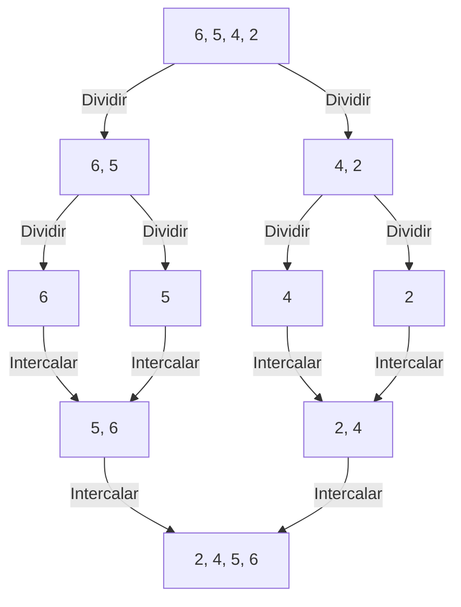
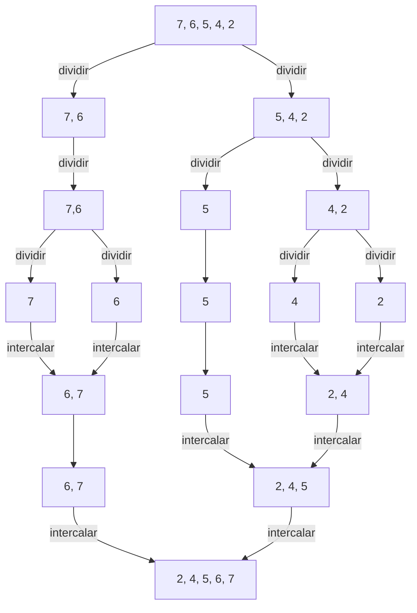
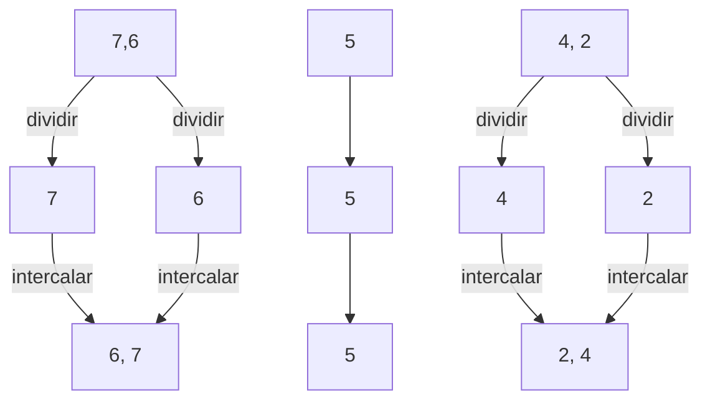
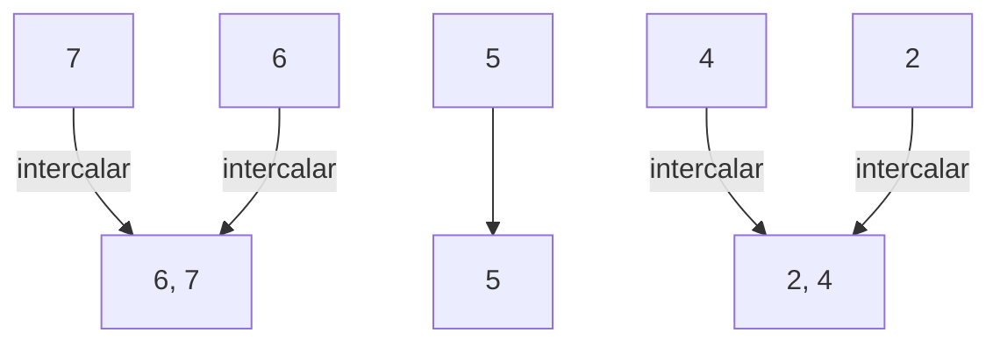
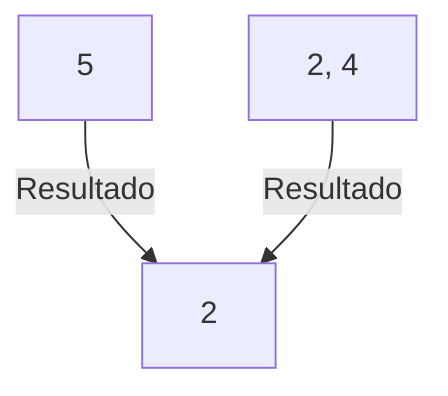
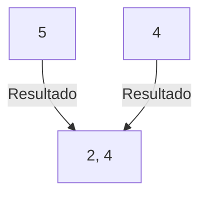
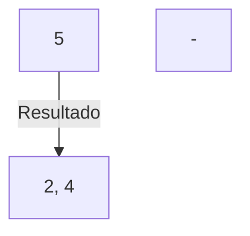

# Aula 03 - Análise de algoritmos e suas complexidades - Ordenação por intercalação









---


## Ordenação por intercalação

{: .center .shadow}

### A "lógica"

Na última aula foi provocado pensarmos em um paradigma algorítmico comum, conhecido como **dividir e conquistar**.

Já vimos essa estratégia, quando estudamos funções recursivas.

Basicamente consiste em:

- Desmembrar o problema em subproblemas semelhantes ao problema original.

- Resolvemos os subproblemas recursivamente.

- Então combinamos as soluções para os subproblemas para resolver o problema original.


Será que com essa estratégia, conseguiremos um $\Theta < n^2$?


Precisamos fazer dois movimentos básicos:

- Dividir a lista numérica.

- Intercalar os valores, segundo o comparativo binário.

### Exemplos

Isso significa que, por exemplo:



Parece fácil, que tal fazermos mais um exemplo, porém com uma quantidade impar de elementos.


`[7, 6, 5, 4, 2]`




### O algoritmo - A implementação

Assim como na ordenação por inserção

Iremos implementar a função `ordenacao_intercalacao`. 

Essa função irá receber um objeto python do tipo `list` e com seus elementos numéricos.


Para os passos a seguir iremos usar a lista numérica de 5 elementos: `[7, 6, 5, 4, 2]`

```py title="ordenacao_intercalacao" linenums="1"
def ordenacao_intercalacao(lista):
    ...

lista_numerica = [7, 6, 5, 4, 2]

print(f'Lista Desordenada: {lista_numerica} \n')
ordenacao_intercalacao(lista_numerica)
print(f'Lista Ordenada: {lista_numerica} \n')
```

```sh title="saída"
Lista Desordenada: [7, 6, 5, 4, 2]

Lista Ordenada: [7, 6, 5, 4, 2]
```

Iremos usar novamente as funções de impressão que utilizamos na aula anterior:

```py title="ordenacao_intercalacao" linenums="1" hl_lines="1 7 10 16"
def imprime_indices(lista):
    lista_indices = []
    for i in range(0, len(lista)):
        lista_indices.append(i)
    print(f'Indices: {lista_indices}')

def imprime_valores(lista):
    print(f'Valores: {lista}')

def imprime(lista):
    imprime_indices(lista)
    imprime_valores(lista)
    print('')

def ordenacao_intercalacao(lista):
    imprime(lista)

lista_numerica = [7, 6, 5, 4, 2]

print(f'Lista Desordenada: {lista_numerica} \n')
ordenacao_intercalacao(lista_numerica)
print(f'Lista Ordenada: {lista_numerica} \n')
```

```sh title="saída"
Lista Desordenada: [7, 6, 5, 4, 2]

Indices: [0, 1, 2, 3, 4]
Valores: [7, 6, 5, 4, 2]

Lista Ordenada: [7, 6, 5, 4, 2]

```

Nosso teste de mesa improvisado está pronto!

Vamos ao código!

#### Recapitulando:

A ideia da ordenação por intercalação é:

1. **Dividir** a lista numérica ao meio repetidamente até sobrar listas de tamanho 1 (que já estão ordenadas por natureza).

2. **Conquistar** ordenando cada metade recursivamente.

3. **Juntar** (intercalar) duas listas já ordenadas é uma única lista ordenada. 
    - **O coração do nosso algoritmo!**

Irei omitir as demais funções que usamos para depurar nosso código

Para que podemos concentrar apenas no nosso algoritmo.


#### Dividir!

Inicialmente precisamos implementar a parte que irá dividir todas as listas numéricas.

Sem a divisão não temos como conquistar.


Para isso precisamos saber o tamanho da nossa lista atual.

```py title="ordenacao_intercalacao" linenums="1" hl_lines="1"
```


```py title="ordenacao_intercalacao" linenums="15" hl_lines="4"
def ordenacao_intercalacao(lista):
    tamanho = len(lista)

    indice_meio = tamanho // 2

    print(f'Índice do meio: {indice_meio}')
    print(f'Metade esquerda: {lista[:indice_meio]}')
    print(f'Metade direita: {lista[indice_meio:]}')
```

```
ordenacao_intercalacao(lista_numerica)
```

``` title="saída"
Índice do meio: 2
Metade esquerda: [7, 6]
Metade direita: [5, 4, 2]
```

```py title="ordenacao_intercalacao" linenums="15" hl_lines="12 15 16"
def ordenacao_intercalacao(lista):
    tamanho = len(lista)
    
    indice_meio = tamanho // 2

    print(f'Índice do meio: {indice_meio}')
    print(f'Metade esquerda: {lista[:indice_meio]}')
    print(f'Metade direita: {lista[indice_meio:]}')
    print('')
    
    if tamanho <= 1:
        print(f'Lista unitária {lista} já está ordenada')
        print('')
    else:
        ordenacao_intercalacao(lista[:indice_meio])
        ordenacao_intercalacao(lista[indice_meio:])
```

``` title="saída"
Índice do meio: 2
Metade esquerda: [7, 6]
Metade direita: [5, 4, 2]

Índice do meio: 1
Metade esquerda: [7]
Metade direita: [6]

Índice do meio: 0
Metade esquerda: []
Metade direita: [7]

Lista unitária [7] já está ordenada
Índice do meio: 0
Metade esquerda: []
Metade direita: [6]

Lista unitária [6] já está ordenada
Índice do meio: 1
Metade esquerda: [5]
Metade direita: [4, 2]

Índice do meio: 0
Metade esquerda: []
Metade direita: [5]

Lista unitária [5] já está ordenada
Índice do meio: 1
Metade esquerda: [4]
Metade direita: [2]

Índice do meio: 0
Metade esquerda: []
Metade direita: [4]

Lista unitária [4] já está ordenada
Índice do meio: 0
Metade esquerda: []
Metade direita: [2]

Lista unitária [2] já está ordenada
```

Nossa divisão recursiva está pronta!


Vamos retomar a árvore nesse ponto:



Depois que chegarmos nas listas unitárias, para intercalar precisamos olhar para duas listas ao mesmo tempo.



Afim de facilitar vamos criar uma função para intercalar as listas, logo devemos passá-las via argumentos.


```py title="ordenacao_intercalacao" linenums="15" hl_lines="1 17 21"
def intercalar_listas_ordenadas(esquerda, direita):
    ...


def ordenacao_intercalacao(lista):
    tamanho = len(lista)

    indice_meio = tamanho // 2

    print(f'Índice do meio: {indice_meio}')
    print(f'Metade esquerda: {lista[:indice_meio]}')
    print(f'Metade direita: {lista[indice_meio:]}')
    print('')

    if tamanho <= 1:
        print(lista)
        return lista
    else:
        metade_esquerda = ordenacao_intercalacao(lista[:indice_meio])
        metade_direita = ordenacao_intercalacao(lista[indice_meio:])
        return intercalar_listas_ordenadas(metade_esquerda, metade_direita)

```

#### Conquistar!

Agora já concluirmos a parte da divisão e já integramos com a intercalação.

O que fizemos até agora:
- Se a lista for muito pequena, devolva uma cópia. Senão, quebre em duas, ordene cada metade e, por último, intercale.


Vamos focar nesta última parte (**ordenar e intercalar**)

Vamos para a implementação da função `intercalar_listas_ordenadas`:

Precisamos "apontar" para os índices da esquerda e direita simultaneamente.

Como toda lista começa com índice zero, vamos começar declarando esses nossos ponteiros.

```py title="ordenacao_intercalacao" linenums="15" hl_lines="2-3"
def intercalar_listas_ordenadas(esquerda, direita):
    indice_esq = 0
    indice_dir = 0
```
Vamos aproveitar e já declarar o resultado da varredura, que é uma lista.

E será preenchida ordenadamente.

Inicialmente começa vazia, obviamente.


```py title="ordenacao_intercalacao" linenums="15" hl_lines="4"
def intercalar_listas_ordenadas(esquerda, direita):
    indice_esq = 0
    indice_dir = 0
    resultado = []
```

Precisamos validar a varredura.

O ponteiro da esquerda deve varrer até o tamanho da metade esquerda.

E o ponteiro da direita deve varrer até o tamanho da metade da direita.

Ou seja, enquanto (`while`) ambos os ponteiros estiverem dentro da faixa válida:
    
- Comparamos o elemento da esquerda com o da direita (condição do `if`)

- O menor deles colocamos na nossa lista `resultado` (`if` e `else`)

- Avançamos o ponteiro do lado que foi "retirado" o menor elemento. (acréscimo da posição do ponteiro)


```py title="ordenacao_intercalacao" linenums="15" hl_lines="6-12"
def intercalar_listas_ordenadas(esquerda, direita):
    indice_esq = 0
    indice_dir = 0
    resultado = []

    while indice_esq < len(esquerda) and indice_dir < len(direita):
        if esquerda[indice_esq] <= direita[indice_dir]:
            resultado.append(esquerda[indice_esq])
            indice_esq += 1
        else:
            resultado.append(direita[indice_dir])
            indice_dir += 1
```

Vamos voltar a árvore para continuarmos o raciocínio da nossa implementação:



Nosso ponteiro da direita avança:



Avançamos novamente com o ponteiro da direita, e ao fim temos:



Precisamos fazer uma cópia do lado que sobrou:

Onde o índice ainda continua menor que o tamanho da lista, mas não entramos no `if`

Resolvendo essa parte, podemos por fim retornar a lista ordenada `resultado` da intercalação.

```py title="ordenacao_intercalacao" linenums="15" hl_lines="14 18 22-23"
def intercalar_listas_ordenadas(esquerda, direita):
    indice_esq = 0
    indice_dir = 0
    resultado = []

    while indice_esq < len(esquerda) and indice_dir < len(direita):
        if esquerda[indice_esq] <= direita[indice_dir]:
            resultado.append(esquerda[indice_esq])
            indice_esq += 1
        else:
            resultado.append(direita[indice_dir])
            indice_dir += 1
    
    while indice_esq < len(esquerda):
        resultado.append(esquerda[indice_esq])
        indice_esq += 1

    while indice_dir < len(direita):
        resultado.append(direita[indice_dir])
        indice_dir += 1
    
    print(resultado)
    return resultado
```

```
ordenacao_intercalacao(lista_numerica)
```

``` title="saída"
Índice do meio: 2
Metade esquerda: [7, 6]
Metade direita: [5, 4, 2]

Índice do meio: 1
Metade esquerda: [7]
Metade direita: [6]

Índice do meio: 0
Metade esquerda: []
Metade direita: [7]

[7]
Índice do meio: 0
Metade esquerda: []
Metade direita: [6]

[6]
[6, 7]
Índice do meio: 1
Metade esquerda: [5]
Metade direita: [4, 2]

Índice do meio: 0
Metade esquerda: []
Metade direita: [5]

[5]
Índice do meio: 1
Metade esquerda: [4]
Metade direita: [2]

Índice do meio: 0
Metade esquerda: []
Metade direita: [4]

[4]
Índice do meio: 0
Metade esquerda: []
Metade direita: [2]

[2]
[2, 4]
[2, 4, 5]
[2, 4, 5, 6, 7]
```

Perceba o nosso `print(resultado)` a cada intercalação.


``` title="saída"
[2]
[2, 4]
[2, 4, 5]
[2, 4, 5, 6, 7]
```

Como de fato havíamos previsto com a árvore recursiva.


### O algoritmo, finalmente

Vamos limpar os nossos amigos `print()` que ajudaram a entender o algoritmo e seus processos.

Temos, por fim, o nosso script:

```py title="ordenacao_intercalacao" linenums="1"
def intercalar_listas_ordenadas(esquerda, direita):
    indice_esq = 0
    indice_dir = 0
    resultado = []

    while indice_esq < len(esquerda) and indice_dir < len(direita):
        if esquerda[indice_esq] <= direita[indice_dir]:
            resultado.append(esquerda[indice_esq])
            indice_esq += 1
        else:
            resultado.append(direita[indice_dir])
            indice_dir += 1
    
    while indice_esq < len(esquerda):
        resultado.append(esquerda[indice_esq])
        indice_esq += 1

    while indice_dir < len(direita):
        resultado.append(direita[indice_dir])
        indice_dir += 1
    return resultado


def ordenacao_intercalacao(lista):
    tamanho = len(lista)

    indice_meio = tamanho // 2

    if tamanho <= 1:
        return lista
    else:
        metade_esquerda = ordenacao_intercalacao(lista[:indice_meio])
        metade_direita = ordenacao_intercalacao(lista[indice_meio:])
        return intercalar_listas_ordenadas(metade_esquerda, metade_direita)

```

Adicionando as linhas de testes:

Lembre-se que criamos uma lista ordenada nova, chamada `resultado` e a retornamos.

Portanto temos que fazer uma reatribuição com o retorno da função `ordenacao_intercalacao`

```py linenums="36" hl_lines="4"
lista_numerica = [7, 6, 5, 4, 2]

print(f'Lista Desordenada: {lista_numerica} \n')
lista_numerica = ordenacao_intercalacao(lista_numerica)
print(f'Lista Ordenada: {lista_numerica} \n')
```


Como saída:

```title="saída"
Lista Desordenada: [7, 6, 5, 4, 2]

Lista Ordenada: [2, 4, 5, 6, 7]
```


