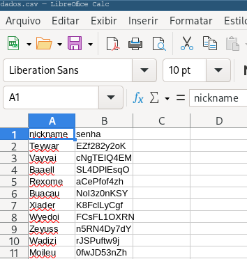
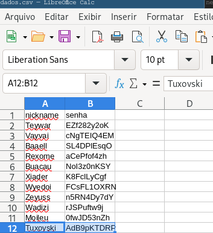

---
search:
  exclude: true
---
# Aula 06 - Entrada e Saída de arquivos (pt. 2)









---

## Escrita (saída) de arquivos

### Revisão dos modos disponíveis

Os modos disponíveis que envolvem escrita de arquivos são:


|Caractere  |Significado                                                                               |
|-----------|-------------------------------------------------------------------------------------------|
|`w`      |Abre para escrita, truncando o arquivo primeiro (remove tudo que estava contido no arquivo.|
|`x`      |Abre para criação exclusiva, falha caso o arquivo exista.                                  |
|`a`      |Abre para escrita, anexa ao final do arquivo caso o mesmo exista.                          |
|`+`      |Abre o arquivo para atualização (leitura e escrita)                                        |


Considere o arquivo (definição de f-strings) que será lido:

```txt title="aula_06/f-strings.txt" linenums="1"
F-strings:
- Permite que se inclua o valor de expressões Python dentro de uma string,
    - Prefixando-a com f ou com F e escrevendo expressões na forma {expressão}.
    - Exemplo (terminal):
      - >>> import math
      - >>> print(f'O valor aprozimado de pi é {math.pi}.')
      - O valor aproximado de pi é: 3.141592653589793
```

### Escrita no modo `'a'`

Como nosso foco é a escrita, iremos fazer a leitura apenas para confirmar o conteúdo do arquivo, por isso basta um [`for` para ler as linhas do arquivo](./aula_05/#maneira-alternativa-de-leitura){:target="_blank"}:


```py title="Terminal interativo - aula_06/exemplo_01.py"
>>> with open('f-strings.txt', encoding='utf-8') as arq:
...     for linha in arq:
...         print(linha, end="")
...
F-strings:
- Permite que se inclua o valor de expressões Python dentro de uma string,
    - Prefixando-a com f ou com F e escrevendo expressões na forma {expressão}.
    - Exemplo (terminal):
      - >>> import math
      - >>> print(f'O valor aprozimado de pi é {math.pi}.')
      - O valor aproximado de pi é: 3.141592653589793
```


Como não queremos truncar o arquivo (remover tudo que já está contido nele), vamos utilizar o modo `a`:


O texto adicional será:

```py title="Terminal interativo - aula_06/exemplo_01.py"
>>> texto = 'Podemos utilizar o especificador \':\' com f-strings.\n'
```

Para escrever usaremos o método `f.write()` que recebe uma `string` e retorna o número de caracteres escritos.


```py title="Terminal interativo - aula_06/exemplo_01.py"
>>> with open('f-strings.txt', 'a', encoding='utf-8') as arq:
...     arq.write(texto)
...
52
```

Retornou **52**, isso significa que foram adicionados (modo `'a'`) 52 caracteres.

Verificando:

```py title="Terminal interativo - aula_06/exemplo_01.py"
>>> with open('f-strings.txt', encoding='utf-8') as arq:
...     for linha in arq:
...         print(linha, end="")
...
F-strings:
- Permite que se inclua o valor de expressões Python dentro de uma string,
    - Prefixando-a com f ou com F e escrevendo expressões na forma {expressão}.
    - Exemplo (terminal):
      - >>> import math
      - >>> print(f'O valor aprozimado de pi é {math.pi}.')
      - O valor aproximado de pi é: 3.141592653589793
Podemos utilizar o especificador ':' com f-strings.
```

Nosso código está ficando repetitivo, que tal automatizarmos alguns processos?

```py title="aula_06/exemplo_02.py" linenums="1"
--8<-- "./codigo/aula_06/exemplo_02.py"
```

A linha 7, verifica se o modo passado como argumento é um modo de escrita. Agora podemos testar esses modos.


Vamos acessar o arquivo interativamente:

```sh title="Terminal"
python -i exemplo_02.py
```


```py title="Terminal interativo - exemplo_02.py"
>>> verifica_arquivo('f-strings.txt')
F-strings:
- Permite que se inclua o valor de expressões Python dentro de uma string,
    - Prefixando-a com f ou com F e escrevendo expressões na forma {expressão}.
    - Exemplo (terminal):
      - >>> import math
      - >>> print(f'O valor aprozimado de pi é {math.pi}.')
      - O valor aproximado de pi é: 3.141592653589793
Podemos utilizar o especificador ':' com f-strings.
```
### Escrita no modo `'r+'`
Vamos explorar a leitura e escrita (atualização) usando o modo `'r+'`, e entender melhor como ele funciona.

```py title="Terminal interativo - exemplo_02.py"
>>> texto = 'Podemos utilizar o especificador \'=\' com f-strings.\n'
>>> escrita_arquivo('f-strings.txt', 'r+', texto)
52 foram escritos
>>> verifica_arquivo('f-strings.txt')
Podemos utilizar o especificador '=' com f-strings.
sões Python dentro de uma string,
    - Prefixando-a com f ou com F e escrevendo expressões na forma {expressão}.
    - Exemplo (terminal):
      - >>> import math
      - >>> print(f'O valor aprozimado de pi é {math.pi}.')
      - O valor aproximado de pi é: 3.141592653589793
Podemos utilizar o especificador ':' com f-strings.
```

O modo `'r+'` é uma atualização de arquivo, portanto irá atualizar nosso arquivo de acordo com a quantidade de caracteres da nova escrita.

Vamos considerar as duas primeiras linhas do nosso arquivo antes da alteração em uma única string:

```py title="Terminal interativo - exemplo_02.py"
>>> frase = 'F-strings:\n- Permite que se inclua o valor de expressões Python dentro de uma string,\n'
>>> frase[:52]
'F-strings:\n- Permite que se inclua o valor de expres'
```


`'F-strings:\n- Permite que se inclua o valor de expres'` foi atualizado para `'Podemos utilizar o especificador \'=\' com f-strings.\n'`

### Modo `'x'`

```py title="Terminal interativo - exemplo_02.py"
>>> texto = 'Podemos utilizar o especificador \'=\' com f-strings.\n'
>>> escrita_arquivo('f-strings.txt', 'x', texto)
Traceback (most recent call last):
  File "<python-input-10>", line 1, in <module>
    escrita_arquivo('f-strings.txt', 'x', texto)
    ~~~~~~~~~~~~~~~^^^^^^^^^^^^^^^^^^^^^^^^^^^^^
FileExistsError: [Errno 17] File exists: 'f-strings.txt'
```

O modo `'x'` abre o arquivo para escrita exclusiva. Portanto não permite escrever em um arquivo que já existe.

```py title="Terminal interativo - exemplo_02.py"
>>> escrita_arquivo('especificadores.txt', 'x', texto)
52 foram escritos
>>> verifica_arquivo('especificadores.txt')
Podemos utilizar o especificador '=' com f-strings.
```

Como o arquivo `especificadores.txt` não existia até então foi possível escrever o conteúdo e criar o arquivo.

### Modo `'w'`

O modo `'w'` irá truncar o arquivo que abrirmos, portanto substitui todo o conteúdo, e não um quantidade específica de caracteres como `'r+'`.


```py title="Terminal interativo - exemplo_02.py"
>>> verifica_arquivo('f-strings.txt')
Podemos utilizar o especificador '=' com f-strings.
sões Python dentro de uma string,
    - Prefixando-a com f ou com F e escrevendo expressões na forma {expressão}.
    - Exemplo (terminal):
      - >>> import math
      - >>> print(f'O valor aprozimado de pi é {math.pi}.')
      - O valor aproximado de pi é: 3.141592653589793
Podemos utilizar o especificador ':' com f-strings.
>>> texto = 'F-strings, um novo olhar:\n'
>>> escrita_arquivo('f-strings.txt', 'w', texto)
26 foram escritos
>>> verifica_arquivo('f-strings.txt')
F-strings, um novo olhar:
```

## Arquivos CSV

Arquivos no formato CSV (Valores separados por vírgula) são também arquivos de texto simples, com a vantagem que os dados contidos estão em formato tabular.

{.center width="300px"}

```csv title="aula_06/dados.csv" linenums="1"
nickname,senha
Teywar,EZf282y2oK
Vayvai,cNgTEIQ4EM
Baaell,SL4DPlEsqO
Rexome,aCePfof4zh
Buacau,NoI3z0nKSY
Xiader,K8FclLyCgf
Wyedoi,FCsFL1OXRN
Zeyuss,n5RN4Dy7dY
Wadizi,rJSPuftw9j
Moileu,0fwJD53nZh
```

```py title="Terminal interativo - exemplo_02.py"
>>> verifica_arquivo('dados.csv')
>>> verifica_arquivo('dados.csv')
nickname,senha
Teywar,EZf282y2oK
Vayvai,cNgTEIQ4EM
Baaell,SL4DPlEsqO
Rexome,aCePfof4zh
Buacau,NoI3z0nKSY
Xiader,K8FclLyCgf
Wyedoi,FCsFL1OXRN
Zeyuss,n5RN4Dy7dY
Wadizi,rJSPuftw9j
Moileu,0fwJD53nZh
```

Para adicionar um novo usuário:

```py title="Terminal interativo - exemplo_02.py"
>>> usuario = 'Tuxovski,AdB9pKTDRP\n'
>>> escrita_arquivo('dados.csv', 'a', usuario)
20 foram escritos
>>> verifica_arquivo('dados.csv')
nickname,senha
Teywar,EZf282y2oK
Vayvai,cNgTEIQ4EM
Baaell,SL4DPlEsqO
Rexome,aCePfof4zh
Buacau,NoI3z0nKSY
Xiader,K8FclLyCgf
Wyedoi,FCsFL1OXRN
Zeyuss,n5RN4Dy7dY
Wadizi,rJSPuftw9j
Moileu,0fwJD53nZh
Tuxovski,AdB9pKTDRP
```

{.center width="300px"}

## Enviando dados via `print()` 

Podemos utilizar o argumento `file` da função embutida `print` para escrever dados em um arquivo.


```py title="Terminal interativo - exemplo_03.py"
with open('saida.txt', 'w') as arq:
    print('Saída pelo print', file = arq)
```

Podemos também apresentar dados com um separador ou com um final de linha diferente usando o `print()`.

Sabemos que por padrão o `print` separa suas strings com espaço e possui o `\n` após a última string.

Os argumentos responsáveis por esse comportamento são o `sep` e o `end`:


```py title="Terminal interativo - exemplo_03.py"
print('Agosto', 31, 9.0)
Agosto 31 9.0
>>> print('Agosto', 31, 9.0, sep='-')
Agosto-31-9.0
>>> print('Agosto', 31, 9.0, sep=',')
Agosto,31,9.0
>>> print('Agosto', 31, 9.0, sep=',', end=' - Fim de mês \n')
Agosto,31,9.0 - Fim de mês
```

## Manipular nomes de caminho

As vezes precisamos encontrar o nome base do arquivo, o nome do diretório em que estamos trabalhando, o caminho absoluto e assim por diante.

Para tudo isso podemos utilizar o módulo embutido `os`.

Para os exemplos a seguir vamos considerar o seguinte arquivo:


{.center width="700px"}

```csv title="aula_06/tabelas/episodios.csv" linenums="1"
No. no geral,Título,Dirigido por,Escrito por,Data de exibição,Audiência (em milhões)
1,Pilot,Justin Roiland,Dan Harmon & Justin Roiland,2 de dezembro de 2013,1.10[1]
2,Lawnmower Dog,John Rice,Ryan Ridley,9 de dezembro de 2013,1.51[2]
3,Anatomy Park,John Rice,Eric Acosta & Wade Randolph,16 de dezembro de 2013,1.30[3]
4,M. Night Shaym-Aliens!,Jeff Myers,Tom Kauffman,13 de janeiro de 2014,1.32[4]
5,Meeseeks and Destroy,Bryan Newton,Ryan Ridley,20 de janeiro de 2014,1.61[5]
6,Rick Potion #9,Stephen Sandoval,Justin Roiland,27 de janeiro de 2014,1.75[6]
7,Raising Gazorpazorp,Jeff Myers,Eric Acosta & Wade Randolph,10 de março de 2014,1.76[7]
8,Rixty Minutes,Bryan Newton,Tom Kauffman & Justin Roiland,17 de março de 2014,1.48[8]
9,Something Ricked This Way Comes,John Rice,Mike McMahan,24 de março de 2014,1.54[9]
10,Close Rick-counters of the Rick Kind,Stephen Sandoval,Ryan Ridley,7 de abril de 2014,1.75[10]
11,Ricksy Business,Stephen Sandoval,Ryan Ridley & Tom Kauffman,14 de abril de 2014,2.13[11]
```


### Para obter o último componente do caminho:

```py title="Terminal interativo - exemplo_04.py"
>>> import os
>>> caminho = './tabelas/episodios.csv'
>>> os.path.basename(caminho)
'episodios.csv'
```

### Para obter o nome do diretório:

```py title="Terminal interativo - exemplo_04.py"
>>> import os
>>> caminho = './tabelas/episodios.csv'
>>> os.path.dirname(caminho)
'./tabelas'
```

### Para reunir os componentes do caminho:

```py title="Terminal interativo - exemplo_04.py"
>>> os.path.join('/tmp', 'testes', 'python')
'/tmp/testes/python'
```

### Separar a extensão do arquivo

```py title="Terminal interativo - exemplo_04.py"
>>> os.path.splitext(caminho)
('./tabelas/episodios', '.csv')
```

