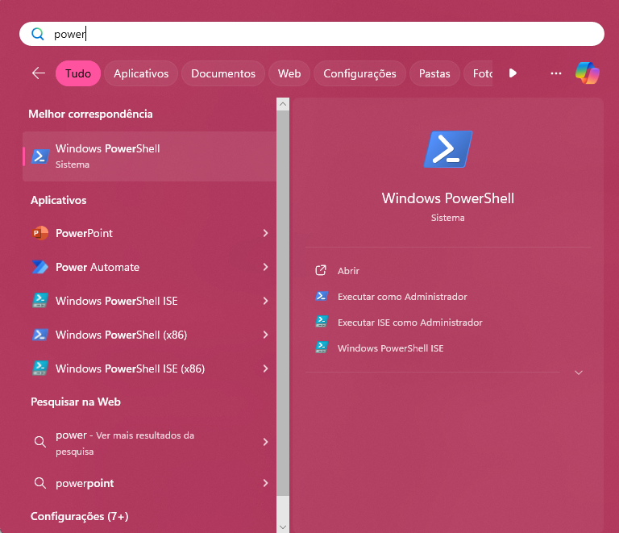
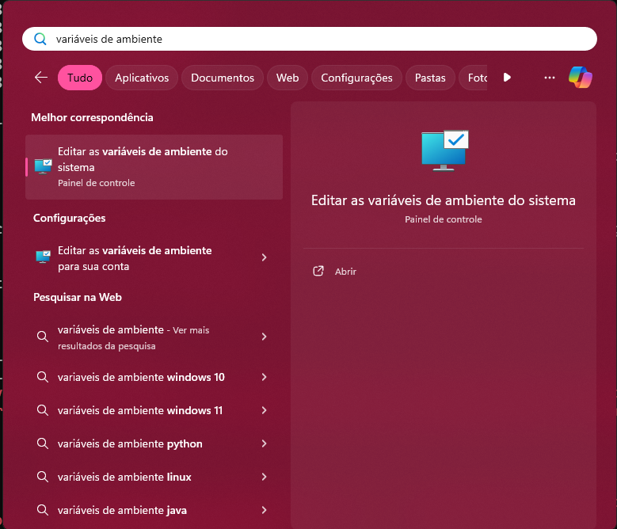
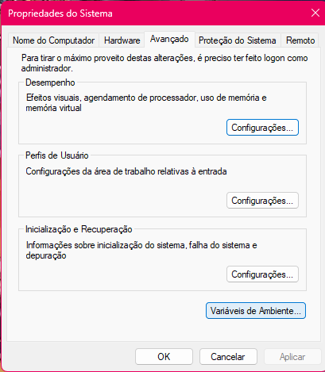
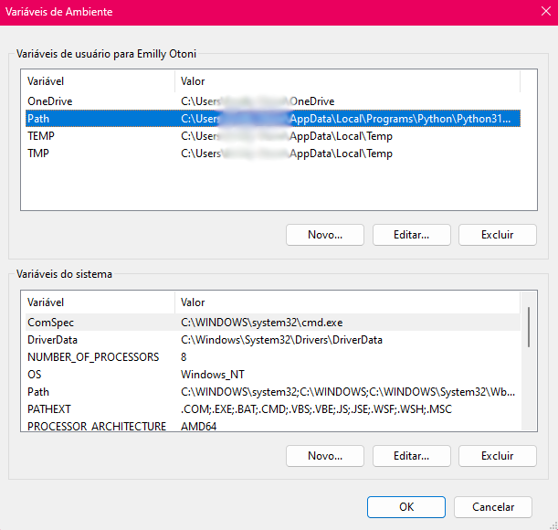
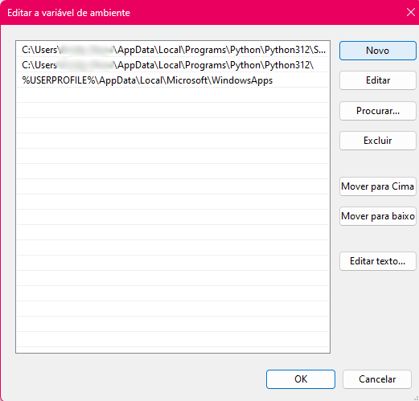

# Aula 07 - Gerenciamento de pacotes e a biblioteca Pandas









---

## PyPI

O Índice de pacotes Python (PyPI) é um repositório de software para a linguagem de programação Python.

O PyPI ajuda você a encontrar e instalar softwares desenvolvidos e compartilhados pela comunidade do Python.

Os autores de pacotes usam o PyPI para distribuir seu software..


## Poetry

### Instalação

####  Linux

Com o `pipx` instalado e referenciado as variáveis de ambiente no `PATH`:

```sh title="Terminal"
pipx install poetry
```


#### Windows

Primeiramente devemos habilitar a execução de script via terminal (PowerShell):

Abra o `PowerShell` no modo administrador:


{.center width="600px"}


Clique o botão do direito do mouse em `Executar como administrador`.

Execute o comando:

```sh title="Terminal"  
Set-ExecutionPolicy Unrestricted
```

Feche o PowerShell e abra-o no modo comum.

Com o Python já instalado no seu sistema operacional:

```sh title="Terminal"
(Invoke-WebRequest -Uri https://install.python-poetry.org -UseBasicParsing).Content | py -
```

Um script será executado e você verá no terminal a seguinte saída:

```sh title="Terminal" hl_lines="22-24"
Retrieving Poetry metadata

# Welcome to Poetry!                                                                                                                
This will download and install the latest version of Poetry,
a dependency and package manager for Python.

It will add the `poetry` command to Poetry's bin directory, located at:

C:\Users\<Seu nome de usuário>\AppData\Roaming\Python\Scripts

You can uninstall at any time by executing this script with the --uninstall option,
and these changes will be reverted.

Installing Poetry (1.8.3)
Installing Poetry (1.8.3): Creating environment
Installing Poetry (1.8.3): Installing Poetry
Installing Poetry (1.8.3): Creating script
Installing Poetry (1.8.3): Done

Poetry (1.8.3) is installed now. Great!

To get started you need Poetry's bin directory 
(C:\Users\<Seu nome de usuário>\AppData\Roaming\Python\Scripts)
in your `PATH` environment variable.

Alternatively, you can call Poetry explicitly with 
`C:\Users\<Seu nome de usuário>\AppData\Roaming\Python\Scripts\poetry`.

You can test that everything is set up by executing:

`poetry --version`

```

Perceba que para iniciarmos o `Poetry` precisamos associar um caminho à uma variável de ambiente do sistema operacional chamada de `PATH`.

Copie esse caminho utilizando `Ctrl + Shift + c`.

Feche o PowerShell.

Digite no pesquisar do Windows: variáveis de ambiente


{.center width="600px"}

Clique em `Editar as variáveis de ambiente do sistema`


{.center width="500px"}

Na parte inferior direita, clique em `Variáveis de Ambiente`


{.center width="500px"}

Seleciona a variável `PATH`, e depois clique em `Editar...`.


{.center width="500px"}

Clique em novo e adicione o caminho fornecido na instalação do `Poetry`.


### Uso básico

Para introdução do uso básico do `Poetry`, instalaremos o `pendulum`, uma biblioteca de data e hora.

#### Novo projeto

Para criar um novo projeto, basta:

```sh title="Terminal"
poetry new projeto-teste
```
Esse comando irá criar o `projeto-teste`, um diretório com o seguinte conteúdo:

```sh title="Terminal"
projeto-teste
├── pyproject.toml
├── README.md
├── projeto-teste
│   └── __init__.py
└── tests
    └── __init__.py
```

Perceba que temos diretórios que devem ser reconhecidos pelo interpretador Python, possuímos diretórios com o arquivo `__init__.py` 

O arquivo `pyproject.toml` é o mais importante do conteúdo gerado. Ele que irá manipular o projeto e dependências.

Deveremos ter algo parecido com:

```toml title="projeto-teste/pyproject.toml"
[tool.poetry]
name = "projeto-teste"
version = "0.1.0"
description = ""
authors = ["Seu nome <nome@email.com>"]
readme = "README.md"

[tool.poetry.dependencies]
python = "^3.12"


[build-system]
requires = ["poetry-core"]
build-backend = "poetry.core.masonry.api"
```
##### Configurando uma versão

Perceba que o `Poetry` especifica explicitamente quais versões do Python você pretende oferecer suporte. Esse bloqueio universal garante que seu projeto seja instálavel (e todas as dependências reivindiquem suporte para) todas as versões Python suportadas.

Ou seja, definir uma versão do Python, significa especificar quais versões do Python pretendemos oferecer suporte.

```toml title="projeto-teste/pyproject.toml"
[tool.poetry.dependencies]
python = "^3.12"
```

No exemplo acima, oferecemos suporte para qualquer versão Python superior a `3.12`

O `Poetry` não instalará um interpretador Python para você. Quando fazermos o `Poetry` funcionar é necessário ter acesso a alguma versão de um interpretador Python que satisfaça essa restrição, disponível no seu sistema.

#### Iniciando um projeto pré-existente

Se já existe um diretório, em vez de criar um novo projeto, o `Poetry` pode ser usado para 'inicializar' um diretório pré-preenchido.

```sh title="Terminal"
cd diretorio-pre-existente
poetry init
```
Dessa maneira, cria um interativamente um arquivo `pyproject.toml` no diretório atual pré-existente.


#### Especificando dependências

Para adicionar dependências ao seu projeto, podemos especificá-las no campo da seção `tool.poetry.dependencies` em `pyproject.toml`:

```toml title="projeto-teste/pyproject.toml"
[tool.poetry.dependencies]
pendulum = "^2.1"
```

É necessário um mapeamento do **nome do pacote** e **restrições de versão**.

O `Poetry` usa essas informações para procurar o conjunto certo de arquivos nos "repositórios" de pacotes, tanto os registrados na seção `tool.poetry.source`, como pacotes que estão no [Índice de Pacotes Python (PyPI)](./aula_07/#pypi).


Uma outra alternativa além de modificar o `pyproject.toml` manualmente, é usar o comando `add`.

```sh title="Terminal"
poetry add pendulum
```

Dessa maneira o `Poetry` irá encontrar automaticamente uma restrição de versão adequada e instalará o pacote e as suas subdependências.


##### Dependências de múltiplas restrições

Poetry suporta uma rica sintaxe de especificação de dependência , incluindo acento circunflexo (^), til (~), curinga (\*), desigualdade (!=) e requisitos de múltiplas restrições .

Para entender as restrições de versão e o controle de dependências por meio do `Poetry`, devemos entender o versionamento semântico de softwares.

Resumidamente, dado um número de versão PRINCIPAL.MENOR.CORREÇÃO (MAJOR.MINOR.PATCH):

- Versão PRINCIPAL quando se faz alterações na API (Interface de programação de aplicações) incompatíveis.
- Versão MENOR quando se adiciona um funcionalidade em uma versão compatível com versões anteriores.
- Versão CORREÇÃO quando você faz correções de bugs compatíveis com versões anteriores.

[Para saber mais...](https://semver.org/){: target="_blank"}

Requisitos de cursor, permitem atualizações compatíveis com versionamento semântico para uma versão especificada.

Uma atualização será permitida se o novo número de versão não modificar o dígito diferente de zero mais à esquerda no agrupamento de **correções** principal e secundário.

Por exemplo, ao executar:

```sh title="Terminal"
poetry add pendulum@2.13.0
```

!!! note "Operador @"
    Ao adicionar dependências via `poetry add`, podemos usar o operador `@`. Isto é entendido de forma semelhante ao operador `==` sintaxe, mas também permite prefixar qualquer especificadores válidos em `pyproject.toml`.

E queiramos atualizar a biblioteca, com `poetry update pendulum`, o Poetry nos atualizaria para versão `2.14.0` se estivesse disponível, mas não atualizaria para `3.0.0`. Se especificarmos a versão `^0.1.13`, o Poetry atualizaria para `0.1.14`, mas não para `0.2.0`.

###### Requisitos de cursor

<table>
<thead>
<tr>
<th>Exigência </th>
<th>Versões permitidas </th>
</tr>
</thead>
<tbody>
<tr>
<td>^1.2.3 </td>
<td>&gt;=1.2.3 &lt;2.0.0 </td>
</tr>
<tr>
<td>^1.2 </td>
<td>&gt;=1.2.0 &lt;2.0.0 </td>
</tr>
<tr>
<td>^1 </td>
<td>&gt;=1.0.0 &lt;2.0.0 </td>
</tr>
<tr>
<td>^0.2.3 </td>
<td>&gt;=0,2,3 &lt;0,3,0 </td>
</tr>
<tr>
<td>^0.0.3 </td>
<td>&gt;=0,0,3 &lt;0,0,4 </td>
</tr>
<tr>
<td>^0.0 </td>
<td>&gt;=0,0,0 &lt;0,1,0 </td>
</tr>
<tr>
<td>^0 </td>
<td>&gt;=0,0.0 &lt;1,0.0 </td>
</tr>
</tbody>
</table>


###### Requisitos de Til

Os requisitos do Til especificam uma versão mínima com alguma capacidade de atualização. Se você especificar uma versão principal, secundária e de correções ou apenas uma versão principal e secundária, somente alterações em nível de correções serão permitidas. Se você especificar apenas uma versão principal, serão permitidas alterações em nível secundário e de correções.\

`~1.2.3` é um exemplo de uso.

<table>
<thead>
<tr>
<th>Exigência </th>
<th>Versões permitidas </th>
</tr>
</thead>
<tbody>
<tr>
<td>~1.2.3 </td>
<td>&gt;=1.2.3 &lt;1.3.0 </td>
</tr>
<tr>
<td>~1.2 </td>
<td>&gt;=1.2.0 &lt;1.3.0 </td>
</tr>
<tr>
<td>~1 </td>
<td>&gt;=1.0.0 &lt;2.0.0 </td>
</tr>
</tbody>
</table>


###### Requisitos de desigualdades

Os requisitos de desigualdade permitem especificar manualmente um intervalo de versões ou uma versão exata da qual depender.

Alguns exemplos de desigualdade: 

`>= 1.2.0`; `> 1`;  `< 2`; `!= 1.2.3`


###### Vários requisitos

Requisitos de múltiplas versões também podem ser separados por vírgula, por exemplo `>= 1.2, < 1.5`.


### Usando ambiente virtual

Antes de usar, precisamos entender o que é um ambiente virtual.

#### Ambiente virtual é (dentre outras coisas):

- Usado para conter um interpretador Python específico e bibliotecas de software e binários necessários para dar suporte a um projeto (biblioteca ou aplicação). Eles são, por padrão, isolados de software em outros ambientes virtuais e de interpretadores e bibliotecas Python instalados no sistema operacional.

- Contido em um diretório, convencionalmente denominado venv ou .venv no diretório do projeto, ou em um diretório contêiner para vários ambientes virtuais, como ~/.virtualenvs.

- Não inserido em sistemas de controle de código-fonte, como Git.

- Considerado descartável – deve ser simples excluí-lo e recriá-lo do zero. Você não coloca nenhum código de projeto no ambiente

- Não é considerado móvel ou copiável – basta recriar o mesmo ambiente no local de destino.

[Para saber mais sobre ambientes virtuais Python, consulte a PEP 405](https://peps.python.org/pep-0405/){: target="_blank"}

Por padrão, o `Poetry` cria ambiente virtuais em `{cache-dir}/virtualenvs`.

Para criarmos os ambientes virtuais dentro do diretório de nossos projetos, precisamos executar o comando:

```sh title="Terminal"
poetry config virtualenvs.in-project true
```

#### Ativando o ambiente virtual

A maneira mais fácil de ativar o ambiente virtual é criar um shell aninhado com `poetry shell`.

Para desativar o ambiente virtual e sair deste novo tipo de shell `exit`. 

Para desativar o ambiente virtual sem sair do shell use `deactivate`.

#### Como o Poetry encontra os arquivos certos?

Quando você especifica uma dependência em `pyproject.toml`, Poetry primeiro leva o nome do pacote que você solicitou e pesquisa em qualquer repositório que você registrou usando a chave `repositories`. Se você não registrou nenhum repositório extra, ou não encontrou um pacote com esse nome no repositórios que você especificou, ele volta para `PyPI`.

Quando o Poetry encontra o pacote certo, ele tenta encontrar a melhor correspondência para a restrição de versão que você possui especificado.

#### Instalando dependências

Para instalar as dependências definidas para o seu projeto, basta executar o comando `install`.

O comando `install` lê o arquivo `pyproject.toml` do projeto atual, resolve as dependências e as instala.

```sh title="Terminal"
poetry install1
```

Com o comando `install` duas coisas podem acontecer, que dependem diretamente da existência `poetry.lock`:

##### Sem `poetry.lock`

Se você nunca executou o comando antes e também não há o arquivo `poetry.lock` presente, Poetry simplesmente resolve todas as dependências listadas em seu arquivo `pyproject.toml` e baixa a versão mais recente de seus arquivos.

Quando o Poetry termina a instalação, ele grava todos os pacotes e suas versões exatas que baixou no arquivo `poetry.lock , bloqueando o projeto para essas versões específicas. 

Você deve gerar o arquivo poetry.lock para o repositório do seu projeto para que todas as pessoas que trabalham no projeto fiquem bloqueadas para as mesmas versões de dependências.


##### Com `poetry.lock`

Se já existe um arquivo `poetry.lock`, bem como um arquivo `pyproject.toml` quando você executa `poetry install`, significa que você executou o comando `install` antes, ou outra pessoa no projeto executou o comando `install` e gerou o arquivo `poetry.lock` para o projeto (o que é bom).

De qualquer forma, executando `install` quando um arquivo poetry.lock está presente resolve e instala todas as dependências listadas em `pyproject.toml`, mas o Poetry usa as versões exatas listadas em `poetry.lock` para garantir que as versões do pacote sejam consistentes para todos que trabalham no seu projeto. 

Como resultado você terá todas as dependências solicitadas pelo seu arquivo `pyproject.toml`, mas nem todos podem estar nas versões mais recentes disponíveis (algumas dependências listadas no arquivo `poetry.lock` pode ter lançado versões mais recentes desde que o arquivo foi criado). Isso ocorre por design e garante que seu projeto não seja interrompido devido a alterações inesperadas nas dependências.


## Pacote Pandas


### Descrição

Pandas é um poderoso kit de ferramentas de análise de dados Pyhton (PyPI).


É um pacote Python que fornece recursos rápidos e estruturas de dados flexíveis e expressivas projetadas para facilitar o trabalho com dados “relacionais” ou “rotulados” fáceis e intuitivos. 

Pretende ser o bloco de construção fundamental de alto nível para obter práticos e do mundo real dados análise em Python. 

Além disso, tem o objetivo mais amplo de se tornar o ferramenta de análise/manipulação de dados de código aberto mais poderosa e flexível disponível em qualquer idioma.

Tipos diferentes de dados:

- Dados tabulares com colunas de tipo heterogêneo, como em uma tabela SQL ou Planilha Excel.

- Dados de séries temporais ordenados e não ordenados (não necessariamente de frequência fixa).

- Dados de matriz arbitrária (digitados homogeneamente ou heterogêneos) com linha e rótulos de coluna.

- Qualquer outra forma de conjuntos de dados observacionais/estatísticos. Os dados não precisa ser rotulado para ser colocado em uma estrutura de dados do pandas.

As duas estruturas de dados primárias do pandas são: Series (unidimensional) e DataFrame (bidimensional), lidam com a grande maioria dos usos típicos casos em finanças, estatística, ciências sociais e muitas áreas de engenharia.

pandas é construído em cima do NumPy e tem como objetivo se integrar bem a um ambiente científico ambiente de computação com muitas outras bibliotecas de terceiros.

!!! note "NumPy"
    Já vimos que NumPy é um Biblioteca Python que fornece um objeto array multidimensional, vários derivados objetos (como arrays e matrizes mascaradas) e uma variedade de rotinas para operações rápidas em matrizes, incluindo manipulação matemática, lógica, de forma, classificação, seleção, E/S, transformadas discretas de Fourier, álgebra linear básica, operações estatísticas básicas, simulação aleatória e muito mais.

Para cientistas de dados, o trabalho com dados normalmente é dividido em vários estágios: limpar e limpar dados, analisando/modelando-os e organizando os resultados da análise em um formato adequado para exibição gráfica ou exibição tabular. pandas é a ferramenta ideal para todas essas tarefas.

## Jupyter Notebook

Como estamos trabalhando com dados, precisamos interagir com essas informações de maneira visual.

Para isso iremos utilizar o `Jupyter Notebook`

É um aplicativo simplificado de criação de notebook e faz parte do Project Jupyter , um grande projeto guarda-chuva centrado no objetivo de fornecer ferramentas (e padrões ) para computação interativa.

Um `Notebook` é um documento compartilhável que combina código, descrições em linguagem simples, dados, visualizações ricas como modelos 3D, tabelas, gráficos e figuras e controles interativos. Um `Notebook`, junto com um editor como o Jupyter Notebook fornece um ambiente interativo rápido para prototipagem e explicação de código, exploração e visualização de dados e compartilhamento ideias com outras pessoas.

## Hora de programar...

```sh title="Terminal"
poetry new primeiros_passos_pandas
```

```sh title="Terminal"
cd .\primeiros_passos_pandas
```

```sh title="Terminal"
poetry add notebook
```

Um abiente virtual é criado 

```sh title="Terminal"
poetry add pandas
```

```sh title="Terminal"
poetry shell
```

Apareceu (primeiros-passos-pandas-py3.12)

```sh title="Terminal"
where.exe python
```
<caminho do seu diretório>\.venv\Scripts\python.exe

```sh title="Terminal"
jupyter notebook
```

locaalhost:8888\tree

diretório atual

```py title="./primeiros_passos_pandas/exploracao.ipynb"
import pandas as pd
```

Shitf enter -> executa e cria uma nova linha


```py title="./primeiros_passos_pandas/exploracao.ipynb"
dados_ideb = pd.read_csv('./dados/br_inep_brasil.csv')
```

```py title="./primeiros_passos_pandas/exploracao.ipynb"
dados_ideb
```

Visualizaremos nossa planilha (ou dados).

Temos 126 linhas e 11 colunas

Alguns filtros

```py title="./primeiros_passos_pandas/exploracao.ipynb"
dados_ideb[dados_ideb.ensino == 'medio']
```


```py title="./primeiros_passos_pandas/exploracao.ipynb"
dados_ideb[(dados_ideb.ensino == 'medio') & (dados_ideb.ano == 2021)]
```

```py title="./primeiros_passos_pandas/exploracao.ipynb"
dados_ideb[(dados_ideb.ensino == 'medio') &
    (dados_ideb.ano == 2021) &
    (dados_ideb.red.str.contains('p')==True]
```

```py title="./primeiros_passos_pandas/exploracao.ipynb"
!poetry add plotly
```

```py title="./primeiros_passos_pandas/exploracao.ipynb"
pesquisa_pri_pub = dados_ideb[(dados_ideb.ensino == 'medio') &
    (dados_ideb.red.str.contains('p')==True]
```

Grafico de fato:

```py title="./primeiros_passos_pandas/exploracao.ipynb"
pesquisa_pri_pub.plot(x='ano', y='nota_saeb_matematica', color='rede', kind='bar')
```


