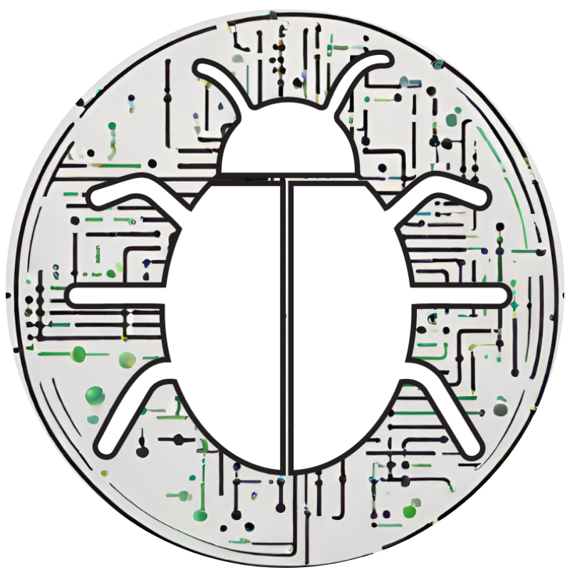

{width="300" .center} 
# Fundamentos de algoritmos e introdução à programação em Python

Olá, boas vindas ao curso de Fundamentos de algoritmos e iniciação à programação em Python!

A intenção deste curso é mesclar os conceitos fundamentais e básicos de algoritmos com a aprendizagem da linguagem de programação Python.

## Sobre o curso?

Esse curso foi desenvolvido para oferecer uma experiência básica e fundamental de programação. O objetivo é compreender as funcionalidades básicas computacionais, tanto no nível dos algoritmos, quanto no nível da linguagem.

O módulo 1 do curso se concentra nos conceitos básicos de linguagem: como manipular variáveis e instruções, funções, como utilizar expressões booleanas e operadores, iteração, recursão, estruturadas de dados embutidas.

O módulo 2 está direcionado à aplicação do que foi aprendido no módulo 1. Veremos: Complexidade e análise de algoritmos, como se constrói e integra módulos e pacotes, expressões regulares para reconhecimento e criação de padrões, integração entrada/saída de arquivos, introdução à análise de dados, como realizar scrapping de dados e as principais tendências do uso da linguagem Python.

## O que você vai aprender?

1. Complexidade e análise de algoritmos: aprenderemos como analisar computacionalmente/matematicamente algoritmos.
2. Módulos e pacotes: Como criar nossas próprias bibliotecas de algoritmos, como integrar com novos projetos.
3. Expressões regulares: O que é um padrão em computação, e como reconhecê-los por meio de uma expressão.
4. Arquivos: Integrar a entrada/saída do seu script com qualquer tipo de arquivo.
5. Pacote pandas: Estatística e análise de dados utilizando Python.
6. Web Scrapping: Criação de rede ou integração de informações.

## Onde o curso será disponibilizado?

1. Em livro texto: todo material está disponível nessa página;
2. Em aulas síncronas ao vivo.
3. Em formato de vídeo (assíncronas): todas as aulas serão disponibilizadas em formato de vídeo.

## Pré-requisitos

Para aproveitar ao máximo todo o conteúdo do curso, é recomendado que você apenas esteja em dia com o conteúdo.

A [Aula 01 - Primeiro contato com a programação](./Módulo 1/aula_01.md) é a aula mais básica do curso, e não exige nenhum pré-requisito.

## Aulas

### Módulo 1
1. [Aula 01 - Primeiro contato com a programação](./Módulo 1/aula_01.md)
2. [Aula 02 - Variáveis, expressões e instruções](./Módulo 1/aula_02.md)
3. [Aula 03 - Funções](./Módulo 1/aula_03.md)
4. [Aula 04 - Operadores e manipulação de scripts em Python](./Módulo 1/aula_04.md)
5. [Aula 05 - Expressões boolenas, operadores e execução condicional](./Módulo 1/aula_05.md)
6. [Aula 06 - Recursividade](./Módulo 1/aula_06.md)
7. [Aula 07 - Introdução à iteração](./Módulo 1/aula_07.md)
8. [Aula 08 - Iteração (continuação)](./Módulo 1/aula_08.md)
9. [Aula 09 - Métodos de lista](./Módulo 1/aula_09.md)
10. [Aula 10 - Iteração (continuação), instrução For](./Módulo 1/aula_10.md)
11. [Aula 11 - Estrutura de dados embutida, dicionários](./Módulo 1/aula_11.md)

### Módulo 2
1. [Aula 01 - Apresentação do módulo 2 e introdução à análise de algoritmos](./aula_01.md)
2. [Aula 02 - Análise de algoritmos e suas complexidades](./aula_02.md)

### Quem vai ministrar essas aulas?

Prazer! Eu me chamo Everson.

{ align=left width="300" .shadow}
Sou programador Python e professor de ciências da natureza e matemática no ensino médio. Este é o primeiro material que desenvolvo do zero para ensinar conceitos de programação e algoritmos.

Programação é uma das minhas paixões. E espero que você também se divirta, conhecendo esse mundo novo.

<!---## 📖 Licença

 Todo esse material é gratuito e está sob licença Creative Commons [BY-NC-SA](https://creativecommons.org/licenses/by-nc-sa/4.0/){:target="_blank"}. O que significa que:

- Você pode copiar e reproduzir esse material em qualquer meio e em qualquer formato;
- Você pode adaptar esse material e construir outros materiais usando esse material.

Pontos de atenção:

- Você precisa dar os devidos créditos a esse material onde for usar ou adaptar;
- Você não pode usar para fins comerciais. Como vender ou usar para obter vantagens comerciais;
- Todo o material derivado desse material deve ser redistribuído com a licença [CC BY-NC-SA](https://creativecommons.org/licenses/by-nc-sa/4.0/){:target="_blank"}. -->

## 🧰 Ferramentas necessárias para acompanhar o curso

1. Um editor de texto ou IDE de sua escolha.
2. Um terminal. Todos os exemplos do curso são executados e explicados no terminal. Você pode usar o que se sentir mais a vontade e for compatível com seu sistema operacional.
3. Ter um interpretador Python instalado em uma versão igual ou superior a `3.11`

<!---## 🔧 Ferramentas de apoio--->

